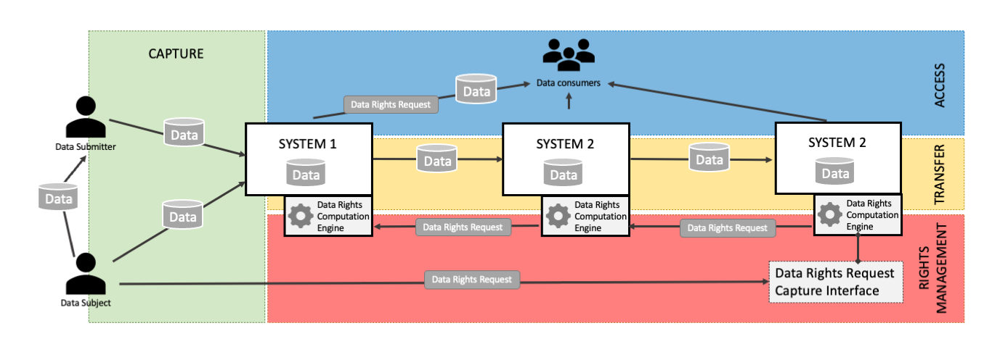

# HIGH-LEVEL COMPONENT ARCHITECTURE

| Status        | DRAFT                                                             |
| :------------ | :---------------------------------------------------------------- |
| **PR #**      | [596](https://github.com/blindnet-io/product-management/pull/596) |
| **Author(s)** | milstan (milstan@blindnet.io)                                     |
| **Sponsor**   | Filip (filip@blindnet.io)                                         |
| **Updated**   | 2022-05-09                                                        |

## Objective

This document describes the high-level view of the context in which our product requirements exist and suggests a high-level structure of components of the product that can meet those requirements.
The goal is to complement the [High Level Conceptualisation](https://github.com/blindnet-io/product-management/blob/milstan-hla/refs/high-level-conceptualization/README.md) document with additional information about the workflows and context in which those concepts exist and at the same time suggest a very general component structure of our system.

## Motivation

The understanding of the context of use is very important in order to cover relevant user needs.

Also, having the right structure of components is very important for several reasons, including for:

- client systems to be able to use only a part of our system,
- our system to be interoperable with 3rd party solutions (that cover a sub-scope of our scope or that cover requirements adjacent to our scope),
- our system to be able to evolve in certain aspects with as little as possible impact on its functioning in other aspects.

### Overview of the Context

### Key Functions

The system supports secure capture of data and management of Data Subjects' rights throughout the data lifecycle.
As such it needs to support the following functions:

- Data Capture
- Encryption and Access
- Storage
- Transfer
- Data Rights Management

## Proposal - Components

### Capture Component

The Capture Component is the key entry point responsible for putting in motion [Data Captures](https://github.com/blindnet-io/product-management/blob/milstan-hla/refs/high-level-conceptualization/README.md#the-main-concept---data-capture) in a way that reinforces privacy by ensuring confidentiality and control.
It may be responsible for encrypting the data, obtaining [Consent](https://github.com/blindnet-io/product-management/blob/milstan-hla/refs/high-level-conceptualization/README.md#data-capture--consent), and generating Data Capture metadata.

### Encryption and Access Management Engine

The Encryption and Access Management is composed of SDKs and APIs allowing to encrypt and decrypt the data in the context of [Data Captures](https://github.com/blindnet-io/product-management/blob/milstan-hla/refs/high-level-conceptualization/README.md#the-main-concept---data-capture).

This component can work with external user identity management solutions.
The component allows Client Systems and end-user-facing components to define and modify the intended Data Consumers of a particular Data Capture.
This component also provides functions allowing to support [Data Consumers](https://github.com/blindnet-io/product-management/blob/milstan-hla/refs/high-level-conceptualization/README.md#submitter--data-consumer--dpo) in situations of lost access.

### Data Rights Computation Engine

Data Rights Computation Engine is a component that client systems can run in order to interpret their rights to hold and treat a particular [Data Capture](https://github.com/blindnet-io/product-management/blob/milstan-hla/refs/high-level-conceptualization/README.md#the-main-concept---data-capture) at a particular point of time, as well as in order to respond to [Data Subjects](https://github.com/blindnet-io/product-management/blob/milstan-hla/refs/high-level-conceptualization/README.md#submitter--data-consumer--dpo)' [Data Rights Requests](https://github.com/blindnet-io/product-management/blob/master/refs/high-level-conceptualization/README.md#data-capture--rights-requests).

A Data Rights Computation Engine component is composed of three elements:

- a [Data Rights Compiler](#data-rights-compiler)
- a [Data Rights Request Capture Interface](#data-rights-request-capture-interface)
- a [Customizable API](#customizable-api)

#### Data Rights Compiler

A **_Data Rights Compiler_** computes one or more actions (and to them association motivations/reasons/explanations) that need to be performed by the system in order to respect the user's data rights.
Such actions may include (not limited to): data deletion, acceptance/denial of Data Rights Requests, and transmission of a Data Rights Requests to another system.

To compute the appropriate actions, this component can register and take into account:

- Data Capture metadata including [Consents](https://github.com/blindnet-io/product-management/blob/milstan-hla/refs/high-level-conceptualization/README.md#data-capture--consent);
- Data Rights [Settings](https://github.com/blindnet-io/product-management/blob/milstan-hla/refs/high-level-conceptualization/README.md#form-follows-function) of a particular system (e.g. storage location, mandatory duration of data keeping, [Legal Grounds](https://github.com/blindnet-io/product-management/blob/master/refs/high-level-conceptualization/README.md#data-capture--legal-ground) etc.);
- History of transmissions to other systems;
- Data Rights Requests;
- Human input (validation, user ID confirmation, etc.) in response to Data Rights Requests.

#### Data Rights Request Capture Interface

A **\*Data Rights Request Capture Interface** is a standardized end-user interface that systems can (optionally) run to capture Data Rights Requests from Data Subjects.
A global Data Rights Request Capture Interface can be hosted on an easy-to-remember URL to capture Data Rights Requests in a standardized format (Data Rights Request Schema) on behalf of other systems.

#### Customizable API

The **_Customizable API_** allows Client Systems and end-user-facing components to:

- set and modify system-specific [Settings](https://github.com/blindnet-io/product-management/blob/milstan-hla/refs/high-level-conceptualization/README.md#form-follows-function) related to Data Rights and compliance (e.g. storage location, mandatory duration of data keeping, legal grounds of treatment etc.)
- register and keep track of system-to-system transfers of data captures and noteworthy operations performed on data

> **NB**. The system-specific Settings can make the output of Data Rights Computation Engine to the same Data Rights Request fundamentally different.
>
> For example, if System A has transmitted a Data Capture to System B, and Systems and A and B have different Legal Grounds for keeping data, when the Data Subject makes a DELETE request, the output of one system's Data Rights Computation Engine might be to approve the DELETE request and of the other to deny it.

This engine works in a way inspired by [Digital Rights Management](https://en.wikipedia.org/wiki/Digital_rights_management).

### Data Consumer Interface

The Data Consumer Interface component allows [Data Consumers (in different roles, including system administrators and DPOs)](https://github.com/blindnet-io/product-management/blob/milstan-hla/refs/high-level-conceptualization/README.md#submitter--data-consumer--dpo) to interact with the components of the system.
It allows the following functions (that can be used separately and should correspond to separate subcomponents):

- _VIEW_: Data display for the eyes of authorized, authenticated Data Consumers, [acceptance/validation of Data Captures](https://github.com/blindnet-io/product-management/blob/master/refs/high-level-conceptualization/README.md#data-capture---states), and data deletion/modification;
- _CONFIGURE_: Input of parameters related to data rights management, necessary for the operation of the Data Rights Computation Engine (e.g. storage location, mandatory duration of data keeping, [Legal Grounds](https://github.com/blindnet-io/product-management/blob/master/refs/high-level-conceptualization/README.md#data-capture--legal-ground) etc.);
- _COMPLY_: Input related to treatment (acceptance, denial) of Data Rights Requests, review of past Data Rights Requests and obtaining proof of past Data Rights Requests responses.

### Schemas

For the system to support interoperability with other systems and solutions, the following schemas should be made (and data export/import implemented using them):

- **Data Rights Request Schema**: to represent [Data Rights Requests](https://github.com/blindnet-io/product-management/blob/master/refs/high-level-conceptualization/README.md#data-capture--rights-requests) made by users and allow their transfer from system to system and enforcement of Data Subject's Rights across systems holding his/her/their data.
- **Data Capture Schema**: to represent the metadata about data captures (including [Consents](https://github.com/blindnet-io/product-management/blob/milstan-hla/refs/high-level-conceptualization/README.md#data-capture--consent), [Data Subjects](https://github.com/blindnet-io/product-management/blob/milstan-hla/refs/high-level-conceptualization/README.md#submitter--data-consumer--dpo), etc.) and allow transfer of encrypted captured data across systems while maintaining the integrity of data and its intended usage by intended data consumers

### Storage

The Storage component allows Client Systems to store the Data Captures.
It can interface with systems that don't have their own storage but integrate the whole confidential data capturing as a fully external workflow, only integrated at the front-end level with their website or app.

The storage component can be configured to automatically interpret and execute data deletions and modifications according to the output of the Data Rights Computation Engine.

## Other Requirements

### Bridge and Interoperability

The components of the system should be made in a way that favors interoperability — i.e. components can easily interoperate with software made in another project for the same purpose.

This principle is already explained in the example of [confidentiality and control interoperability](https://github.com/blindnet-io/product-management/blob/milstan-hla/refs/high-level-conceptualization/README.md#confidentiality--control-bridge).
Appropriate abstractions should be designed on top of key components for (at least, not limited to) user identity, access management, encryption, Data Rights management, storage, and Data Rights Request capture.
These abstractions should follow the [Bridge Pattern](https://en.wikipedia.org/wiki/Bridge_pattern).

This interoperability should support the following (extreme) example scenarios:

- A system that users Keycloak for user identity management, can use our Data Capture component in combination with 3rd party Encryption library. The system can instantiate and use our Data Rights Computation Engine, and implement their own Storage able to automatically interpret and enforce actions resulting as output of the Data Rights Computation Engine (automatic deletion and modification).
- A system that is essentially a wordpress website, can embed the Capture Component in a wordpress webform, use the Storage Component, the Data Consumer Interface (as separate from the wordpress website), use Data Rights Computation Engine and embed the A Data Rights Request Capture Interface in the wordpress website respecting its look and feel.
- A system that has their own user identity management, uses 3rd party e2ee library, has its own storage and interfaces for data view, can instantiate the Data Rights Computation Engine and use only the parts of the Data Consumer Interface related to Data Rights Request parametration and approval.

### Separation of Form and Function

The components of the system should be made in such a way that a client system can use only the functional part and implement its own interfaces or otherwise achieve its own desired look and feel and UX.

## Related Documents

- [High Level Conceptualization](https://github.com/blindnet-io/product-management/tree/master/refs/high-level-conceptualization)
- [Lexicon](https://github.com/blindnet-io/product-management/blob/master/refs/privateform-lexicon.csv)
- [Digital Rights Management](https://en.wikipedia.org/wiki/Digital_rights_management)
- [Bridge Pattern](https://en.wikipedia.org/wiki/Bridge_pattern)
