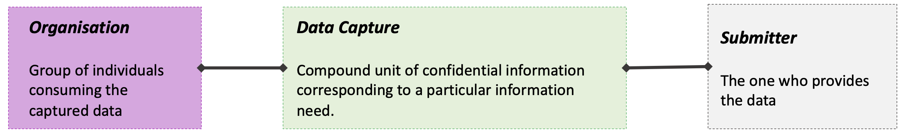
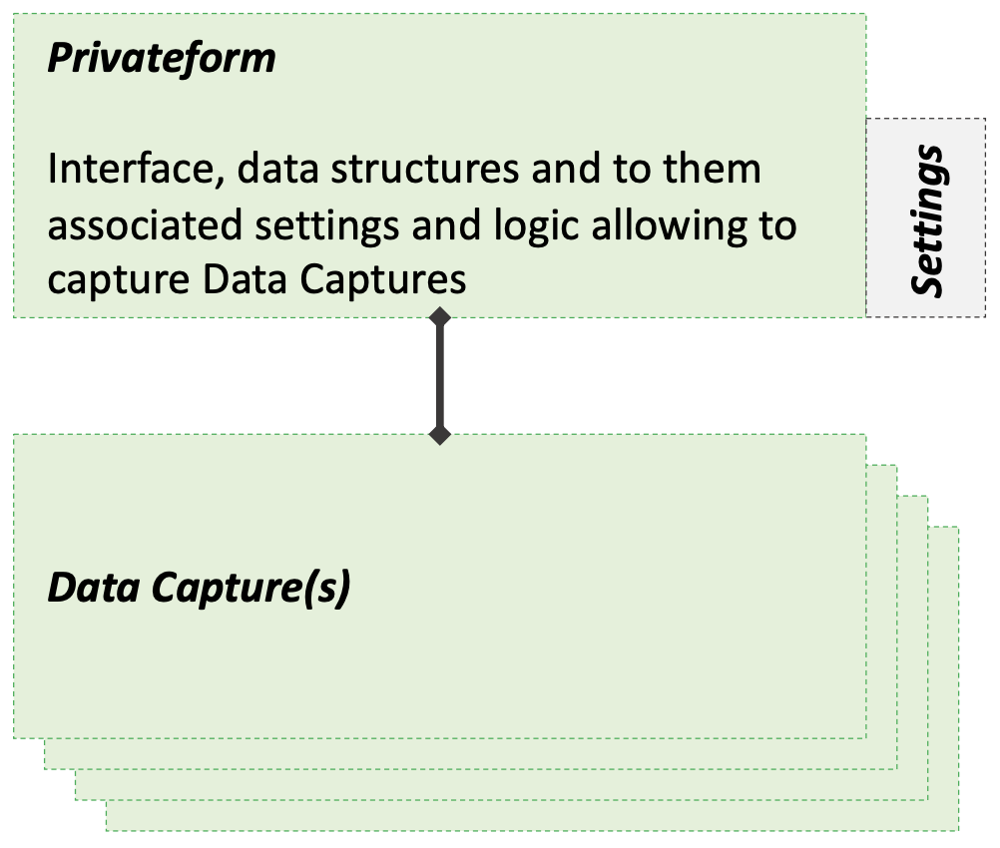
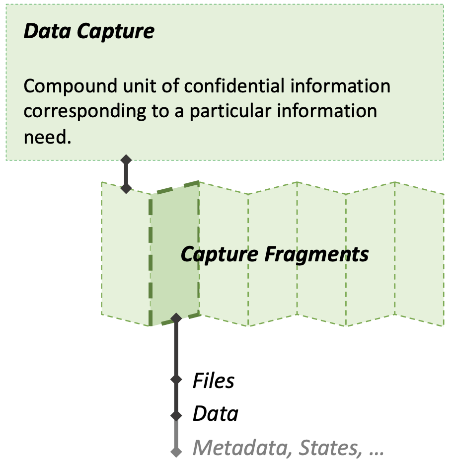
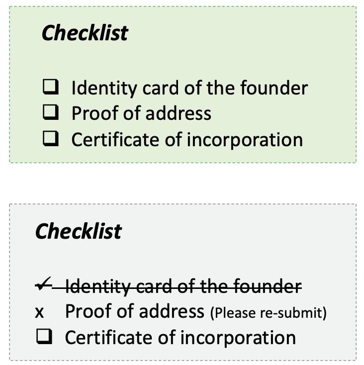
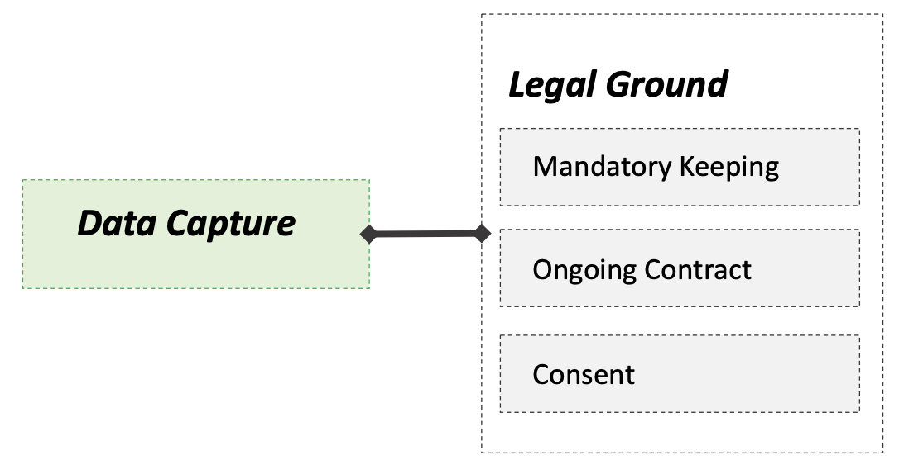
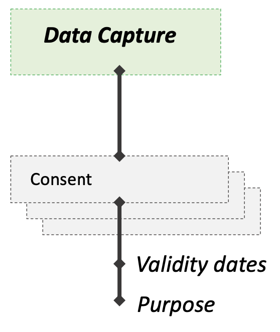
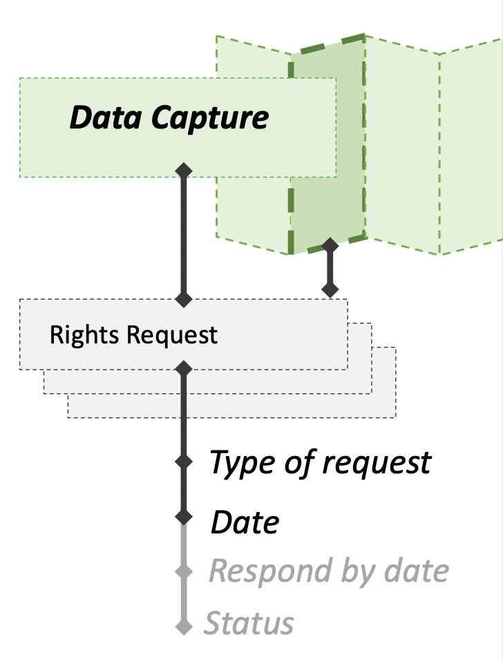
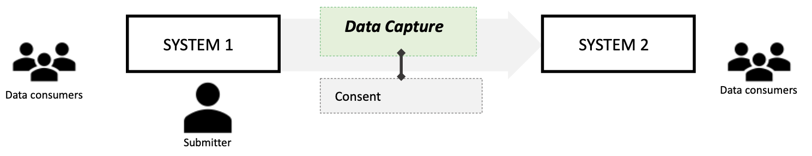
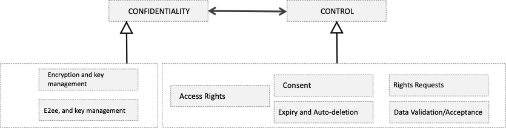

# HIGH-LEVEL CONCEPT ARCHITECTURE

> **The promise: blindnet is the simplest solution for confidential data capture**
>
> It enables a new software paradigm - it allows to build new kind of software, with privacy embedded in its design and architecture, meaning that the data that users generate and share is kept confidential even from the software itself and the ones controlling it.

_This high-level architecture describes the conceptualization behind blidnet’s software, in terms of the information it deals with and the reality it enables.
This conceptualization does not directly translate to any database structure, workflow, or code. It aims to inform software designers’ thinking, guide design choices, and reduce confusion._

## THE MAIN CONCEPT - DATA CAPTURE

A Data Capture is the most central concept of interest in blindnet.

A Data Capture is a compound unit (composed of other units) of confidential information provided by a Submitter to an Organisation.
It corresponds to a particular data exchange need, and can be composed of files and other data fields of different types.
A Data Capture can be captured at once or over the course of multiple interactions.

Examples of a need include: medical history of a new patient (doctor); candidate CV (company hiring); a set of legal proofs in a lawsuit provided by a client (lawyer); identity documents of founders in the investment KYC process (VC fund).

## FORM FOLLOWS FUNCTION

By a Privateform we understand the interface, the data structures and to them associated settings and logic allowing to capture Data Captures.

Settings may include configurations related to delays of conservation and expiry of Data Captures, confidentiality and access rights to captured data, consent collection options, view/decrypt rights and similar.

When a submitter interacts with an instance of Privateform, a Data Capture is created.

## DATA CAPTURE - FRAGMENTS

A Data Capture has one or many Capture Fragments.

A Capture Fragment is a meaningful compound of elementary information units (files, different types of fields) that are meaningfully captured together.

Information units are meaningfully captured together if it doesn’t make sense to capture one of them today and the other tomorrow.

Examples include: a file and a comment explaining it; a set of fields composing an address; a set of questions related to the same topic;

The data structure of Data Capture Fragments allows to have interface elements such as granular progress bars, or checklists to present to the user the state of completement of the submission.

The granularity can also allow, when needed, to the data consumers to accept or reject certain fragments for reasons of readability/conformity, and make the submitter submit them again.

It may also favor incremental data submission (submit par of the for today, and another part some other day when the submitter collects more data), as well as partial modification and data update focused only on particular fragments.

## DATA CAPTURE – LEGAL GROUND

Depending on the relationship between the submitter and the organization, as well as the context of data capture and use, a Data Capture can be associated with different legal grounds for collecting, keeping and treating data. Legal grounds impact the following properties of a particular Data Capture that our systems allows to compute:

- Data **CAN** be kept at a given time
- Data **MUST** be kept at a given time

**See more about legal grounds** [here](https://www.cnil.fr/fr/les-bases-legales). More than one legal ground can exist for the same data at the same time.
E.g.:

- A user can give explicit consent, and at the same time keeping the data might be mandatory; When the user revokes consent, the data must still continue to be kept.
- A service contract can exist between the user and the organization making the organization legitimate to keep the data, and at the same time the user might give consent. After contract has ended, the data can be kept until the user revokes consent and withing the maximal conservation time allowed by law.

The CAN/MUST-be-kept of the data at a given time is also constrained by [maximal conservation times defined by law](https://www.cnil.fr/fr/les-durees-de-conservation-des-donnees) or by minimal legally mandatory conservation time in certain domains (finance).

Such times are often relative to some event (e.g. data collection date, or a date when the submitter-organization relationship or contract has ended).

> _Managing legal ground should be a value-added service allowing to trigger automatic Data Capture deletion, or its protection from user-initiated deletion_

## DATA CAPTURE – CONSENT

Consent is a particular form of legal ground for data collection and keeping. When it is the only legal ground, consent MUST be explicitly collected while capturing data (even partial Data Capture without all fragments completed). When consent is collected then, a possibility must be given to the submitter to revoke it.

Consents have states (e.g., valid, expired, revoked).

One consent corresponds to [one and only one purpose](https://www.cnil.fr/fr/les-bases-legales/consentement) (e.g., facilitate future purchases, ongoing contract, promotions, 3rd party communication). Thus, a Data Capture can be associated to more then one consent, that can be given and revoked separately.

## DATA CAPTURE – RIGHTS REQUESTS

A data subject (person) has the right to demand different things related to his privacy, his data and his rights. Those things may be:

- **General information** about policies, storage locations, practices, and purposes of data treatment (unrelated to any particular Data Capture)
- **Particular information** about Data Capture date, origin of data, etc.
- Data access and manipulation rights **related to a particular Data Capture or Data Capture Fragment**.
- Opposition to treatment (can be denied if unreasonable i.e. if other legal ground
  exists)

The system should allow to capture such requests, keep track of them, and on what is done to act upon them, and provide proof that the action upon the requests was compliant (rights given/denied according to law and in time).

Capturing requests related to a particular Data Capture or Data Capture Fragment requires user authentication.

## DATA CAPTURE - STATES

Data Captures have states. States can be observed on the Data Capture level, or on the level of a Data Capture Fragment.

States concern different qualities, such as (not limited to):

- **Submission** (captured or missing)
- **Consumption** (viewed or new)
- **Acceptance** (accepted, rejected, under review)
- **Expiry** (In mandatory keeping, possible keeping, possible conservation expired, mandatory update pending)

Legal grounds also have states indicating if the data MUST or CAN be kept/deleted.

Rights requests also have states (e.g., received, denied, granted,...) – states relative to a particular request.

Also, rights have states, meaning that in a particular state, a particular type of rights request MUST be rejected. For example, during mandatory keeping a DELETE request from the user MUST be rejected.

> _The information provided here is just for illustrative purposes and does not imply any definitive naming or semantics of actual states._

## DATA CAPTURE – INTEROPERABILITY

More than one system can use our system to collect, store, and exploit data. In other words, the Data Capture can be generated by a submitter within one system, but the data consumers may be consuming the data using multiple different systems.

Systems can exchange Data Captures without compromising the encryption of the data. In addition, they can use blindnet to pass any change of state, legal grounds, consents, or data modifications, rights requests, etc., between systems.

Blindnet serves as a _lingua franca_ for both confidentiality (encryption) and control (legal ground/consent). While encryption de-facto constrains access to the data, the control part is not enforceable upon the systems but is rather enabling them to stay compliant and demonstrate compliance.

## SUBMITTER / DATA CONSUMER / DPO

**Submitters** are users providing the data. In many situations, it is safe to assume that the data subject is the submitter (that the submitter is providing data about himself). However those two are fundamentally different concepts. Thus, in order to be compliant, the system must also allow to capture Rights Request from a data subject regardless of the fact whether they are the submitter or not. Submitter can be anonymous, data subject can’t.

**Data Consumers** are the users who can decrypt and view (and, if appropriate, modify and delete) the data.

**DPO**s are a special type of Data Consumers that use the system to respond to Rights Requests. They may have limited access to the data itself but leverage the system as a proof of having acted legally and respected data subjects’ rights.

## CONFIDENTIALITY – CONTROL BRIDGE

Privacy, in a psychological sense, equals the freedom of an individual to engage/disengage from certain relationships (and identities such relationships project upon them). This freedom to engage/disengage in the context of internet interactions, relies on two main pillars:

- **confidentiality** (the information being kept confidential from unintended data consumers or purposes)
- **control** (impose actions over data to the data consumers by the data subject)

Confidentiality is enforced by policy and by encryption. Control is enforced by law. blindnet allows software systems to handle both.

However, there must be a separation between the two allowing a developer to use blindnet only for one of these two purposes, and use an alternative solution for the other. E.g., a developer can use a non-encrypted web form to capture data, manage his own access to it, and still use blindnet for managing consent, and submitter rights requests.
