# Privacy Request Interchange Vocabulary : Scenarios of Use

| Status        | NA / supporting document                                                               |
| :------------ | :------------------------------------------------------------------------------------- |
| **Author(s)** | milstan (milstan@blindnet.io)         |
| **Updated**   | 2022-06-10                                                                             |

## Introduction

This document illustrates different scenarios in which [Privacy Request Interchange Vocabulary](./RFC-PRIV.md) MAY be used.

The goal of this document is to explore the design implications for implementing systems, that might arise from different situations.

## Terminology

- The key words "MUST", "MUST NOT", "REQUIRED", "SHALL", "SHALL NOT", "SHOULD", "SHOULD NOT", "RECOMMENDED",  "MAY", and "OPTIONAL" in this document are to be interpreted as described in [RFC 2119](https://datatracker.ietf.org/doc/html/rfc2119)
- The key word "CAN" denotes ability of someone or something, and is interpreted as "MUST be able to"
- The key words "blindnet devkit", "CCPA", "CPRA", "Capture Fragment", "Component", "Data Capture", "Data Capture Fragment", "Data Consumer", "Data Subject", "DPO", "Fragment", "GDPR", "HIPPA", "Internet User", "Organization", "Privateform", "Privacy Request", "System", "Submitter", "User" are to be interpreted as described in [RFC-Lexicon-2](../lexicon/RFC-Lexicon-2.md)
- Any additional precision about the key words defined in [RFC-Lexicon-2](../lexicon/RFC-Lexicon-2.md), as well as additional key words such as "Consent" and "Legal Base", provided in [High Level Conceptualization](../high-level-conceptualization/) is to be considered normative
- All key words denoting components of [blindnet devkit](../lexicon/RFC-Lexicon-2.md#blindnet-devkit), such as "Capture Component", "Encryption and Access Management Engine", "Privacy Computation Engine", "Privacy Compiler", "Privacy Request Capture Interface", "Customization API", "Data Consumer Interface", "Schemas" and "Storage Component" are to be interpreted as defined in [High Level Architecture](../high-level-conceptualization/)
- Privacy Compiler was formerly known as Data Rights Compiler
- Privacy Request was formerly known as Data Rights Request
- All the concepts, properties and terms listed in the [Proposal](./RFC-PRIV.md#proposal) section of PRIV(Privacy Request Interchange Vocabulary are to be interpreted as defined in [Privacy Request Interchange Vocabulary](./RFC-PRIV.md#proposal)

## Authentication
### Anonymous

Systems MAY process certain requests without asking the user for their identity. This is especially the case with some of the `TRANSPARENCY` requests, in response to which general information is given.

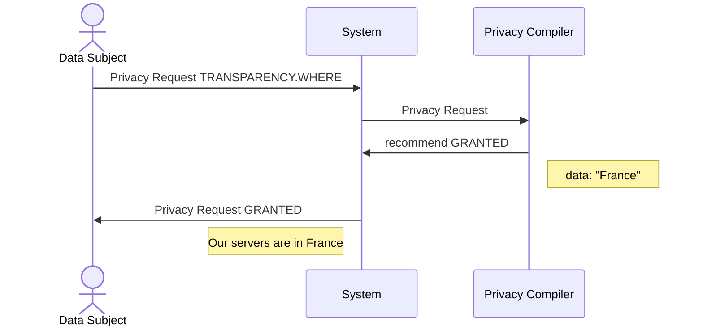

In certain cases, such as with GDPR ([articles 13 and 14](./examples.md#articles-13-and-14)), Systems MAY find themselves in obligation to provide information prior to capturing any data. However, in such cases, Systems are expected to [respond differently to the same requests](./expected-behavior.md#resolving-requests), with regards to the Data Subject being authenticated or not. For example a `TRANSPARENCY.DATA-CATEGORIES` request for an anonymous Data Subject MAY trigger a response listing all the possible data categories that the System is configured to collect. The same request for the authenticated Data Subject MAY trigger a response listing only the categories of data that the System has on this particular Data Subject.

### A Priori Authentication

The Data Subject formulates a Privacy Request when their identity is already confirmed.

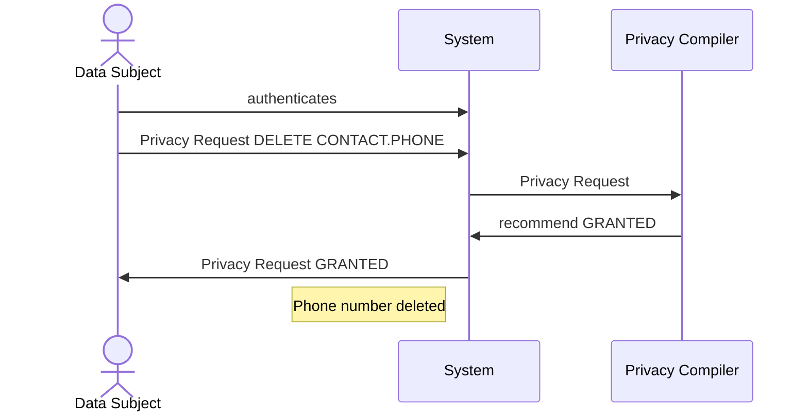

### A Posteriori Authentication

The Data Subject formulates a Privacy Request before their identity is confirmed.

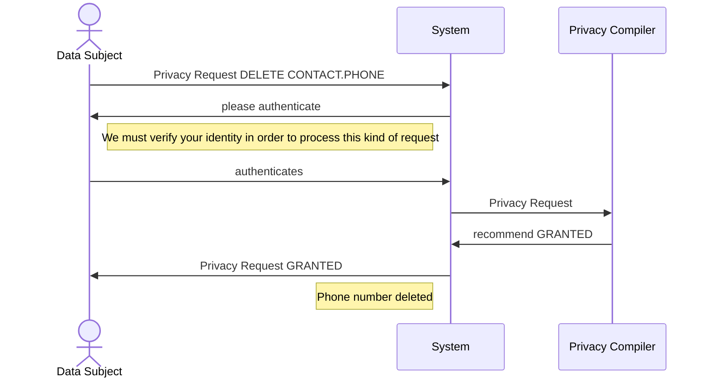

### Signle Point Authentication for Corresponding Systems

In a context of multiple corresponding Systems, only one System confirms the identity of the user, and other Systems only process the Privacy Request.

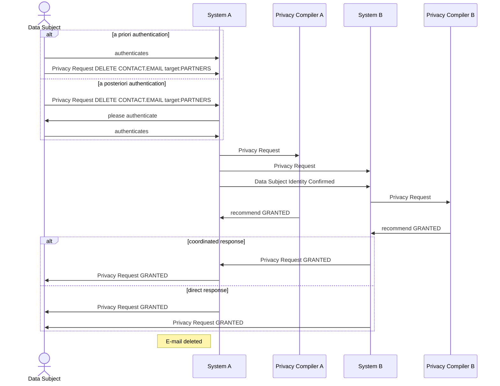

### Independent Authentication for Corresponding Systems

In a context of multiple corresponding Systems, every System confirms the identity of the Data Subject in their own way.

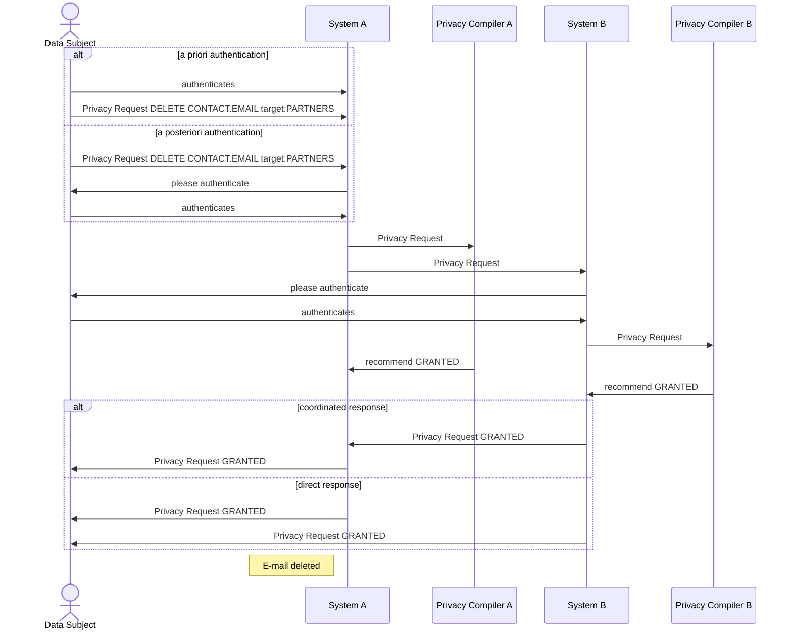

## Automation

### Automatic Processing

Systems MAY be configured to process certain Privacy Requests automatically.

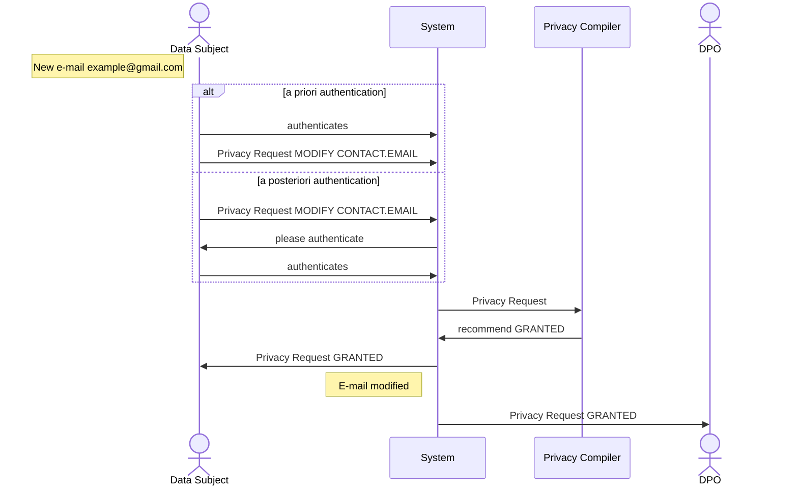

### Semi-Automatic Processing

Systems MAY be configured to process certain Privacy Requests with human validation.

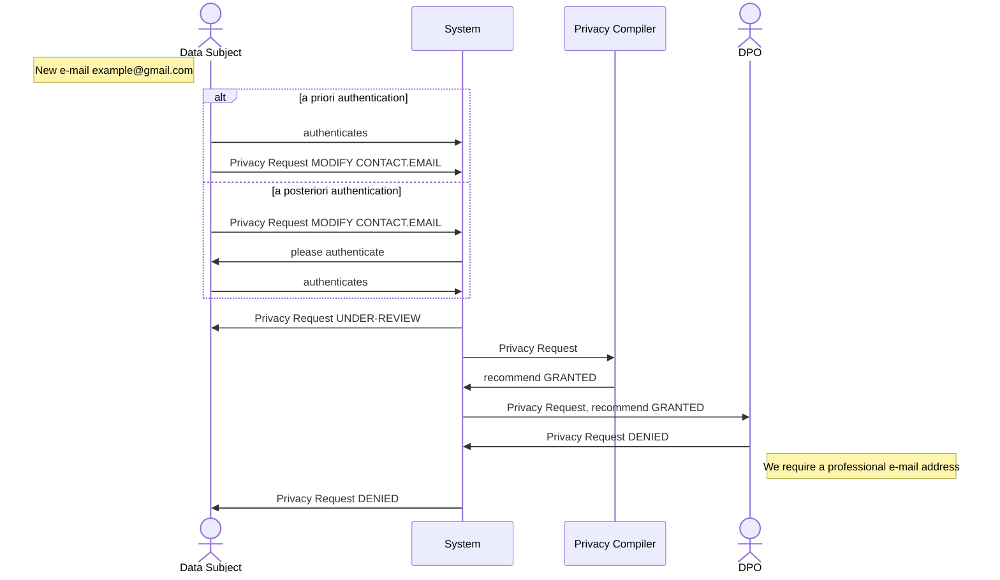

### Manual Processing

Certain Privacy Request can't be interpreted automatically and MUST be processed by a human.

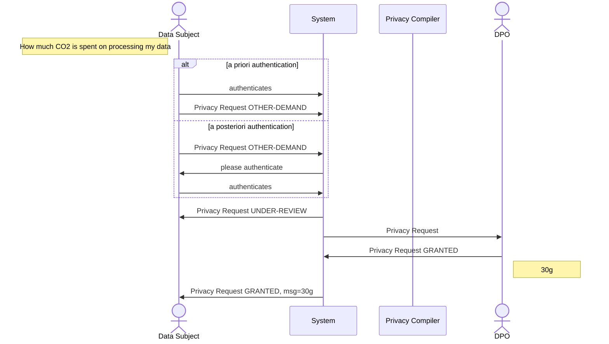
## Response

## Coordinated Response

When a Privacy Requests concerns corresponding Systems, they MAY be configured to respond to it in a coordinated way. The System having received the Privacy Requests gathers responses from corresponding Systems, and creates one single response to present to the user.

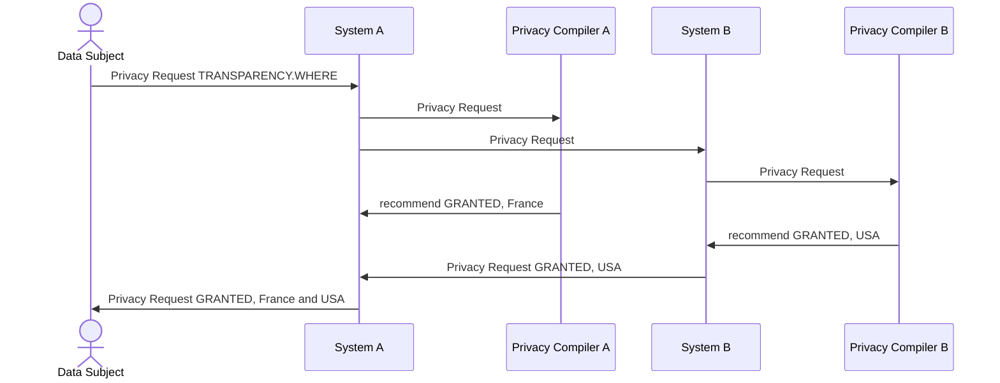
## Direct Response

When a Privacy Requests concerns corresponding Systems, they MAY be configured to have each System reply to the Data Subject independently.

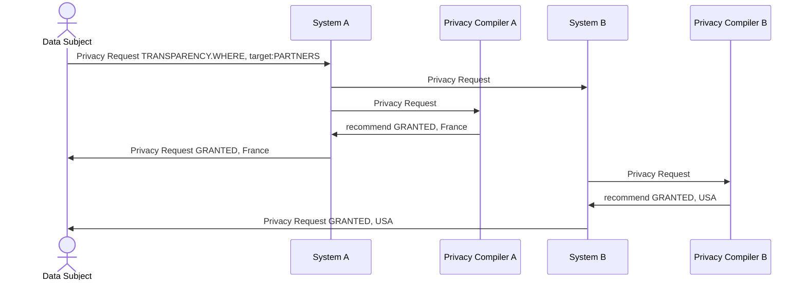

## Capture

## A Complex Journey of a Data Capture

A Data Capture MAY end up being shared among several Systems. We illustrate this on an example. System A and System B are a part of the same Organization, while System C is a part of a Partner Organization.

This complex scenario may take place under different [authentication](#authentication), [automation](#automation), and [response](#response) scenarios. For the sake of clarity of the diagram, we don't include all the possible options. We also abstract Privacy Compilers and interactions with them, as well as Data Consumers and DPOs.

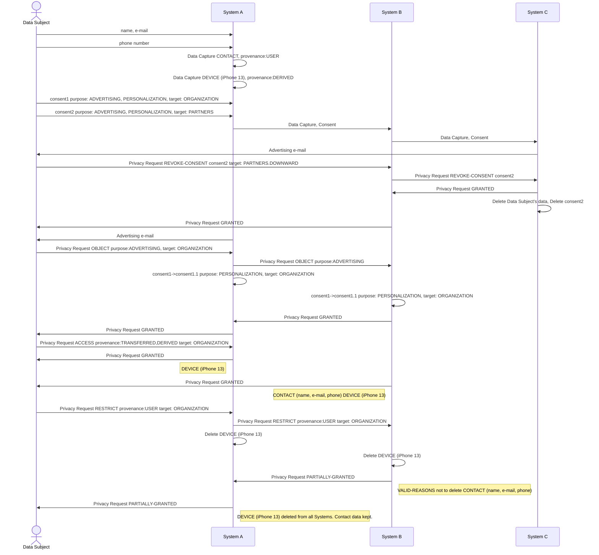

## References

### Normative References

- **[RFC8259]**  Bray, T., ["The JavaScript Object Notation (JSON) Data Interchange Format"](https://datatracker.ietf.org/doc/html/rfc8259), STD 90, RFC 8259, DOI 10.17487/RFC8259, December 2017.

### Supported Legislation

- [GDPR](https://eur-lex.europa.eu/eli/reg/2016/679/oj)
- [CCPA](https://leginfo.legislature.ca.gov/faces/codes_displayText.xhtml?division=3.&part=4.&lawCode=CIV&title=1.81.5)

### Yet to be Supported Legilsation

- CPRA
- HIPPA
