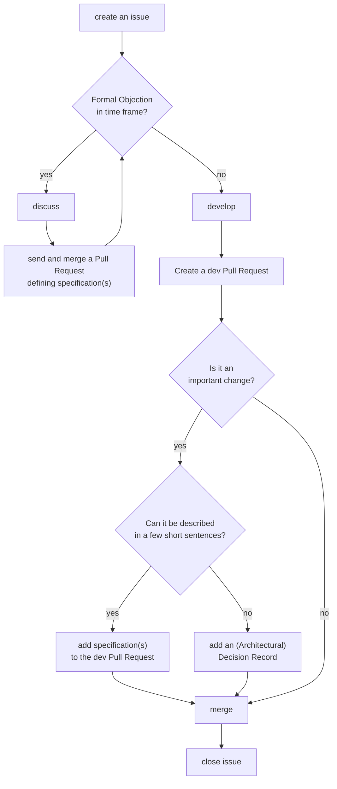

# Specification

The first step of building products at blindnet always includes specification writing. It helps not only us to rapidly build better products, but we hope it also helps others better understand how our products work.

 

> **Please report any issues or errors you find in the specification in this repository .**

There are two categories of specification, _product specification_ and _technical specification_.

## Product specification

Product specification defines the product from the end-user point of view, focusing on the problems it solves for the end-users. Two main parts of the product specification are user stories and interaction diagrams.

### User stories

User stories describe, in natural/informal language, atomic parts of a product (or feature) from the end-user perspective. They define end-users' expectations from the product, and the end-users' needs a product aims to fulfill. See [here](./user-stories/) for more details about user stories at blindnet.

### Interaction diagrams

Interaction diagrams capture different forms of interaction between a product and the users. These include:

- Activity diagrams, defining the product through user actions and activities.
- State machine diagrams, defining how the product behaves in relation to different user inputs.
- User interface sketches, defining the look of user-facing parts of the product.

## Technical specification

Technical specification defines the product from the implementational point of view. The main parts of technical specification are functional requirements, architecture, and design.

### Functional requirements

Functional requirements define functional aspects of the product and are captured in the functional requirements document (FRD). Each functional requirement defines one particular function a product needs to deliver, and is assigned a unique code identifier (e.g., FRD-BE01, FR-SDK14).

### Architecture

Product architecture defines different components of the product structure and how they interact together in order to deliver specified functions. For example, the architecture document defines different SDKs, APIs and databases that, when put together, deliver promised functional aspects.

### Design

Product design defines in detail the technical aspects of each architectural component of the product. It includes, for example, database models, or expected inputs/outputs of SDK functions and REST API endpoints. In some cases, like for example for REST API endpoints, the design is described together with the corresponding functional requirement.

## Process

To allow rapid development, thorough specifications are only needed when:

- _before dev_, a formal objection to an informal technical or functional goal had been expressed
  - _then_ the core team needs to rich a consensus leading to an actual functional or technical requirement (with an ADR if necessary).
- _after dev_, a PR introduces a very important and fundamental feature or change
  - _then_ an (A)DR should be included in the same PR to document it.

To enforce this, the core team follows the following process in accordance with the [decision framework](https://github.com/blindnet-io/openness-framework/tree/main/DecisionFramework):

1. A staff or community member creates a simple, straightforward issue in this project to express a _technical_ or _functional_ goal
2. Any staff member can (but doesn't have to) express a **[FORMAL OBJECTION](https://github.com/blindnet-io/openness-framework/blob/main/docs/HOWTOs/PR-review.md#best-practice-for-reviews)**
3. If the issue didn't receive any formal objection within a short by long enough time frame (default: 24 hours), it is considered validated, and the development begins right away
    - i.e. the developer makes a **_choice_**
    - all-important matters **MUST** be sufficiently documented
    - details can (and should, in most cases) be discussed in the issue or an associated draft PR as we go
4. a new PR is created to discuss the implementation of the issue and merged (or rejected in the worst-case scenario)
    - i.e. the developer's **_choice_** becomes a **_decision_**

> **Note:**
>
> If the changes have to occur in several repositories, all PRs are linked together with a `depends on #XXX` and should be merged or closed together at the same time.
