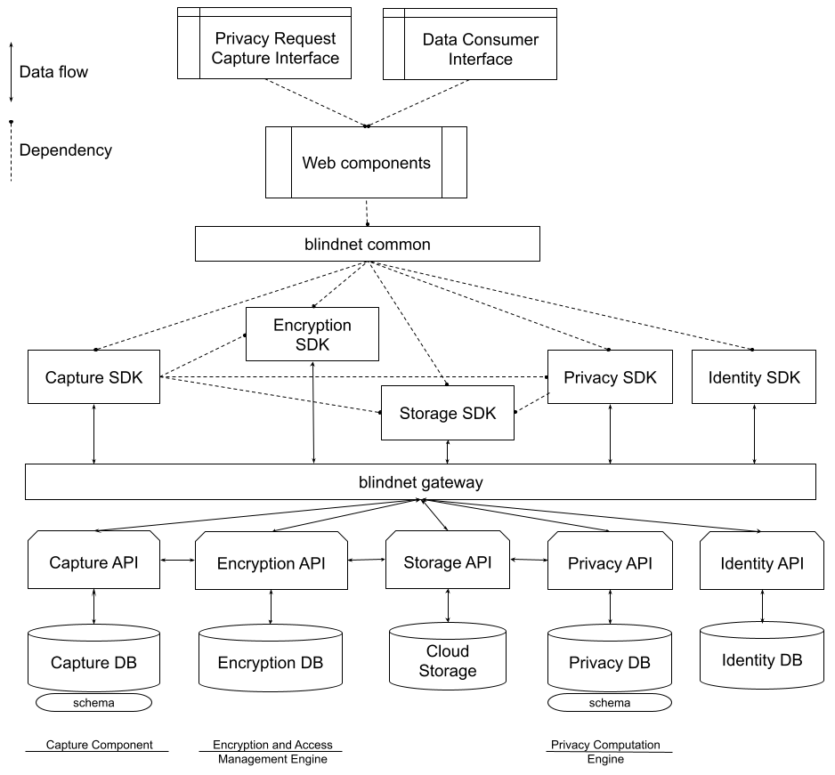

# blindnet devkit Architecture

This document specifies the architecture of the blindnet devkit.

> **Note**
>
> The current version of this document is based mainly on the [HLA][HLA]. It is expected for this document to evolve, especially once the [functional requirements document](../../specifications#functional-requirements) is available.

## Terminology

- All terms defined in [RFC-Lexicon-2][Lexicon] are to be interpreted as described there
- Any additional precision about the terms defined in [RFC-Lexicon-2][Lexicon], as well as additional terms such as Consent and Legal Base, provided in [High Level Conceptualization][HLC] is to be considered normative
- We use the terms Capture Component, Encryption and Access Management Engine, Privacy Computation Engine, Privacy Compiler, Privacy Request Capture Interface, Schemas and Storage Component as defined in [High Level Architecture][HLA]

## Overview

Figure below presents the blindnet devkit architecture.

  

## Responsibilities

Each element within the architecture is responsible for a certain set of functions within the blindnet devkit.

Privacy Request Capture Interface is an end-user interface allowing Data Subjects to submit Privacy Requests.

Data Consumer Interface, as described in the [HLA][HLA], is an end-user interface for Data Consumers which allows them to:
- View and manage Data Captures
- Set relevant configurations (e.g., for Privacy Rights or Legal Bases)
- Manage Privacy Requests

Web components are front-end, look and feel agnostic components which allow integrations of different devkit functions into external systems and web sites. Currently, these include:
- Login component
- Communication (emailing) component
- Custom data capture components
- Data consumption components
- Data rights capture components
- Data rights settings component
- Data rights management components

Blindnet common is an enty point to devkit functions. It is imagined as a single element used by developers, which further uses different parts of the devkit depending on developers' needs.

Different engines within blindnet devkit (Data capture engine, Data encryption engine, Privacy rights engine) consists of several elements, including SDKs, APIs, and databases.

Data capture engine:
- Captures data and metadata for Data Consumers
- Protects confidentiality of Data Captures (encryption)
- Obtains Legal Grounds related to Data Captures
- Allows capturing Data Captures through Data Fragments
- Allows capturing Data Captures over multiple time instances
- Allows multiple Data Submitters to submit a Data Capture
- Allows managing Data Captures on the Data Fragment level

Data encryption engine:
- Encrypts and decrypts data
- Integrable with external OpenID tools
- Allows recovery after acces is lost

Privacy rights engine:
- Captures Data Rights Requests from Data Subjects
- Interprets Data Capture rights (based on Settings)
- Calculates (explainable) response to Data Rights requests
- Keeps traces of Data Rights Requests decisions and actions
- Provides proofs of Data Rights Requests decisions and actions
- Registers operations and transfers of Data Captures across systems
- Allows Data Subjects to revoke Consents

Storage elements of the architecture are responsible for storing the data.

Identity elements of the architecture are responsible for creating and managing users of the devkit (e.g., Data Subjects, Data Consumers, etc.).

## References
- **Lexicon** [RFC-Lexicon-2][Lexicon]
- **HLA** [High Level Architecture][HLA]
- **HLC** [High Level Conceptualization][HLC]

[Lexicon]: ../../refs/lexicon/RFC-Lexicon-2.md "RFC-Lexicon-2"
[HLA]: ../../refs/high-level-architecture/ "High Level Architecture"
[HLC]: ../../refs/high-level-conceptualization/ "High Level Conceptualization"
