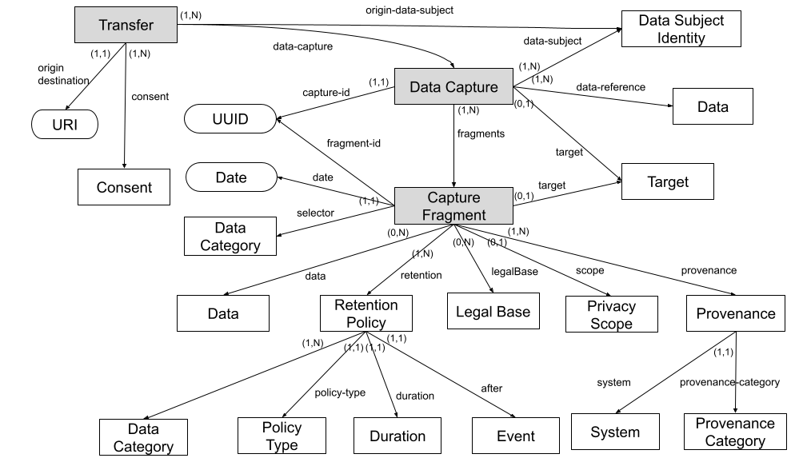

# devkit Data Model

This document specifies blindnet devkit data model. It is based on the [Privacy Request Interchange Vocabulary][priv]. More details about each of the concepts and properties can be found in [PRIV][priv].

All components of the devkit, when dealing with concepts described in this model, must follow the model.

Figure below specifies the model around [Privacy Request][prreq].

  

Figure below specifies the model around [Privacy Request Response][prreqresp].

  

Figure below specifies the model around [Data Capture][dc] and [Data Fragments][df].

  

Figure below specifies the model around [Consents][consent].

  

[priv]: https://github.com/blindnet-io/product-management/blob/devkit-schemas/refs/schemas/priv/RFC-PRIV.md
[prreq]: https://github.com/blindnet-io/product-management/blob/devkit-schemas/refs/schemas/priv/RFC-PRIV.md#privacy-request
[prreqresp]: https://github.com/blindnet-io/product-management/blob/devkit-schemas/refs/schemas/priv/RFC-PRIV.md#privacy-request-response
[dc]: https://github.com/blindnet-io/product-management/blob/devkit-schemas/refs/schemas/priv/RFC-PRIV.md#data-capture
[df]: https://github.com/blindnet-io/product-management/blob/devkit-schemas/refs/schemas/priv/RFC-PRIV.md#data-capture-fragments
[consent]: https://github.com/blindnet-io/product-management/blob/devkit-schemas/refs/schemas/priv/RFC-PRIV.md#consent
