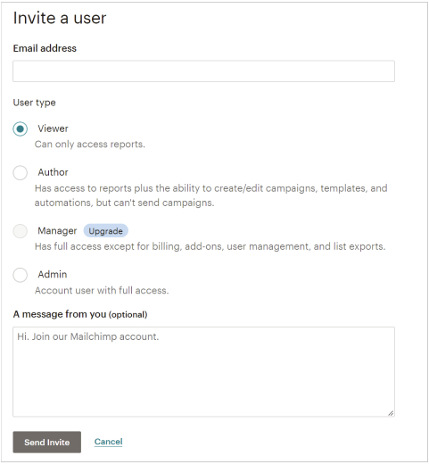

# US 05 Multi-user feature

> figma [Multi-user diagrams and sketches](https://www.figma.com/file/Gu0Jk46m5iRLCaWugM81DX/PF-Multi-user)

## US-05-01

As a logged user, Doctor Amélie, one Doctor among many Doctors in a Medical center, I want to have access to Forms previously filled by Patients of other Doctors, because these patients are now coming to see me and I need to see their data

## US-05-02

As a non-logged user, a patient going to see Doctor Amélie in a Medical center, I do not want to fill forms again because I have already filed them two months ago when I was visiting another doctor and nothing changed in between.

## US-05-03

As a logged user, a secretary within a medical center, I need to send the necessary forms to a patient because he has an appointment with Doctor Amélie soon

## US-05-04

As a logged user, Doctor Amélie within a medical center, I need to access to completed forms that my secretary sent to my patient because I have an appointment with him

## US-05-05

As an unregistered user, a new doctor just starting working in a medical center, I need to access the data of the patients I will be in charge of, because those patients are followed by the medical center for a long time

## US-05-06

As a logged user, Doctor Amélie within a medical center, I need to be able to delete my account without deleting forms data, because I am leaving the medical center and another doctor will now take care of my patients and therefore needs their information

## US-05-07

As a group with registered users, a medical center with doctors, I need to manage GDPR request because I need to be compliant

## US-05-08

As a group with registered users, a medical center with doctors, I need to personalize my page because I want my forms to have the medical center branding

## US-05-09

As a DPO (data protection officer) user, I need to have access to GDPR feature because I am in charge of handling the GDPR requests

## US-05-10

As an admin user, I need to be able to search for a specific doctor because I might need to delete him when he leaves the medical center / or I might need to changes the access he has to the different feature (change his role)

## ALT-US-05

As an admin user for the account, I need to be able to add a user to the account and define the role. The list of roles is predefined with viewing and feature access rights. The viewing rights consist of whether a user needs to see only the forms they requested or all forms. The feature access rights consist of whether a user has access to particular feature set of Privateform: request/submit a new form, send forms to users, delete submitted forms, download submitted forms, fulfill compliance (GDPR) request. The alternative view on multi-user account usage stems from Mailchimp (screenshot below) - majority of Privateform users are not IT professionals and seek simplicity for role assignment.

Mailchimp example to invite users to the existing account:

> _cf. [Privateform User Stories google doc](https://docs.google.com/document/d/1-_iVgamjIm0aH-txl2aVDIfSNRuwS-agKf74G1q1KRk/edit#heading=h.u0rdgpmfwqmq)_
